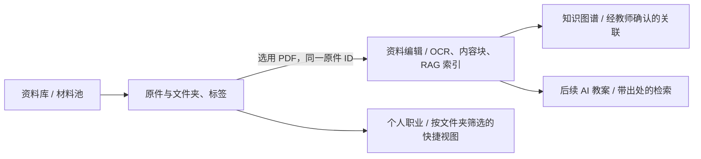

# 材料池产品与技术实施方案

> 文档版本：v1.1
> 日期：2026-09-23
> 状态：首版已通过 PR #46 部署；真实账号与真机验收待完成
> 本次概要：明确材料池方案，并记录首版代码实现与尚需验证的边界。

## 1. 原始问题与目标

教师在备课、公开课、教学比赛、论文课题和职称申报期间会积累大量文件。现在的「资料编辑」以 PDF 解析为中心：上传时要求填写资料信息，文件进入资料库；但许多证明、通知、模板和草稿只需要安全保存、分类和找回。教师还希望在资料编辑中选用已经上传的原件，后续让 AI 教案基于已解析材料检索并标注出处。

**第一阶段目标**：教师能批量上传原件，在手机上快速整理，在电脑上批量管理，并将材料池中的 PDF 送入资料编辑；全程不重复上传或复制原件。以真实教师的一批混合文件验证「上传 → 整理 → 找回 → 选用 → 查看原件」闭环。

**产品边界**：材料池管原件及组织方式；资料编辑管可解析资料的页、OCR、内容块和知识关联；知识图谱管教师确认的知识结构；AI 教案在后续阶段读取已解析材料。上传成功不等于 AI 已理解。

## 2. 已确认事实、假设与未决问题

| 类型 | 内容 |
| --- | --- |
| 已确认 | 当前导航「资料库」只有知识图谱、资料编辑；职业页面里的材料池是占位。资料编辑上传接口和页面只支持 PDF，文件上限 80 MiB。 |
| 已确认 | 资料与内容块在每位教师工作区的 `resources.sqlite` 中；原件在工作区上传目录中，文件通过受保护 API 读取。现有删除资料接口还会删除其原件。 |
| 已确认 | 项目使用 React 19 + TypeScript + Vite + Tailwind、Express 5 + Multer + Zod、`better-sqlite3`、Better Auth；手机和电脑是同一响应式产品。 |
| 产品决策 | 一份原件只有一个所在文件夹，可有多个标签；默认文件夹是可编辑的整理起点，不是不可变的业务分类。 |
| 产品决策 | 「从材料池选择」目前只给资料编辑选 PDF；图片及 Office 文件先保存和下载，不能显示为已解析或已建立 RAG 索引。 |
| 待真实验证 | 教师通常一次整理多少份、两个快捷目标是否足够、预设文件夹命名是否符合真实工作、手机相册选择的实际需求。首轮试用后调整，不先增加复杂自动分类。 |

## 3. 信息架构与对象关系



- 资料库增加「材料池」入口。材料池首页显示「未整理」「最近使用」和文件夹；资料编辑、知识图谱仍有独立入口。
- 默认建立「教学资料」「公开课」「教学比赛」「论文课题」「职称材料」五个顶层文件夹。教师可改名、建子文件夹；首版限制合理层级，例如最多三级，防止手机中出现过深路径。分类依据是**主要工作用途**。
- 「七年级」「数学」「待提交」「2026 年」等横跨多个用途的属性使用标签。搜索可按文件名、文件夹、标签、格式和日期筛选；正文搜索仅覆盖已解析资料，并明确标识范围。
- 个人职业的四个页面先提供指向相应文件夹的快捷入口及筛选视图，不另建文件副本或第二套权威目录。
- 不把文件夹路径编码进物理文件路径。移动和改名只更新数据库元数据，引用 URL 与原件 ID 不变。

## 4. 关键使用流程

### 4.1 上传与状态

1. 教师从材料池上传一个或多个文件，服务端逐个校验大小、实际文件类型和工作区权限，写入原件并返回每项结果。首版沿用单文件 80 MiB 上限，浏览器顺序提交；现有上传限流为每 15 分钟 30 次，触发时停止本批后续请求，并保留已经成功的文件。真实批量规模验证后再决定是否调整配额与限流。
2. 默认放入「未整理」，上传成功后可直接预览或下载。PDF、常见图片可在浏览器预览；Office 文件首版可下载，在线预览需单独验证转换质量及安全性。
3. 文件状态分别显示「上传中」「已保存」「上传失败」「回收站」；只有选用 PDF 后才出现独立的资料解析状态。失败项可重试，成功项不重新上传。
4. 保留原始文件名、扩展名、服务端校验出的 MIME、字节数、SHA-256、上传时间、来源和工作区 ID。相同哈希只提示可能重复，由教师选择保留或取消，不静默合并不同名称和用途的文件。

### 4.2 手机整理与电脑管理

- 手机「快速整理」每次聚焦一份未整理材料：上方预览/文件名/日期，中部完整文件夹选择，底部固定两个最近使用的目标文件夹。点目标文件夹后保存并显示下一份。
- 左滑是「跳过当前份」，右滑是「撤销上一步归类」；始终显示同名按钮和操作反馈，避免用户必须记住手势。滑动只在预览卡片区域生效，PDF 内的翻页和页面滚动不触发归类。
- 两个快捷文件夹可以更换；文件夹卡片不会随队列自动换位。每次归类后提供撤销入口；网络失败时当前卡片保留并说明是否已保存。
- 桌面端以列表、搜索、复选和批量移动为主，支持键盘操作；不把手机的逐份卡片强加给批量整理。手机和电脑共享同一状态、接口及文件 ID。
- 触控目标至少 44×44px；处理安全区域、软键盘、横屏和 200% 缩放。队列位置、筛选、已选文件夹在返回页面或横竖屏切换后保持。

### 4.3 从材料池选用 PDF

- 资料编辑的「上传资料」入口提供「上传新 PDF」「从材料池选择」两个来源；选择器仅展示当前工作区的 PDF，可搜索和预览。
- 选用时沿用材料池文件 ID 和物理原件，创建一条资料编辑记录，保存 `pool_item_id` 外键。教师再填写资料类型、学科等解析元数据；可稍后解析，并明确展示「原件已保存 / 尚未解析」。
- 已被资料编辑选用的材料显示去向和解析状态。再次选用同一 PDF 时打开已有资料，除非以后明确设计多套独立解析配置；首版不静默建立重复索引。
- 删除资料编辑中的解析记录只清除解析结果和索引，不删除材料池原件；移到材料池回收站前若存在引用，要提示并阻止误删。永久清理原件与既有资源删除语义必须同时改造。

## 5. 技术方案与接口契约

### 5.1 复用现有技术栈

| 层 | 推荐实现 | 理由与取舍 |
| --- | --- | --- |
| 前端 | React + TypeScript，沿用现有资料库导航和响应式组件；整理手势使用 Pointer Events，并保留可点击按钮 | 不引入独立移动应用或重型手势库；先解决真实操作闭环。 |
| API | Express Router + Better Auth 工作区中间件 + Multer + Zod | 沿用现有受保护上传、会话及参数校验边界。 |
| 元数据 | 同工作区 `resources.sqlite`，`better-sqlite3` 版本化迁移 | 原件、资料引用和回收站状态可在一个工作区事务中约束；不增设新数据库服务。 |
| 文件 | 当前工作区上传目录下按不可猜测 ID 存储，下载经鉴权 API；内容哈希用于查重提示 | 文件夹变化不搬运大文件；保留现有单实例备份与恢复机制。暂不接入 COS。 |
| 解析与检索 | 沿用 `resources`、`resource_pages`、`resource_chunks`、FTS 与现有 PDF 解析流程 | 材料池本身不创建 OCR/FTS 内容；后续 AI 教案只检索已解析、允许使用的资料，并返回资源 ID、页码和内容块 ID。 |

### 5.2 数据模型草案

```text
pool_folders(id, workspace_scope, parent_id, name, preset_key?, sort_order, created_at, updated_at)
pool_items(id, folder_id?, original_name, detected_mime, size_bytes, sha256,
           disk_path, state, source, created_at, updated_at, trashed_at?)
pool_item_tags(item_id, tag_id)
pool_tags(id, name, created_at)
resources.pool_item_id NULLABLE REFERENCES pool_items(id)
```

- `folder_id = NULL` 表示「未整理」；它是系统视图，不必建立可删除的实体文件夹。预设文件夹用稳定 `preset_key` 识别，名称可修改。
- 所有主键为稳定随机 ID；API 永不返回 `disk_path`。同一工作区内约束文件夹父链、唯一预设键、标签名称与引用完整性；跨工作区 ID 访问返回 404 或 403。
- 文件先写临时路径、校验后原子改名，再提交元数据；数据库写入失败时清理临时文件。备份、恢复和运行中的迁移应把新表及其引用原件纳入一致性校验。
- 旧 `resources` 不直接批量搬文件。迁移为每条旧资料建立对应 `pool_items` 元数据行，指向原有受保护原件，并回填 `pool_item_id`；版本化迁移重复运行不会再次插入。首版旧资料的大小显示为「大小未记录」，库内哈希留空；上线前必须以独立在线恢复点与文件清单校验原件完整性。若需要在页面显示旧资料大小和哈希，再做可中断的逐项回填，不能在服务启动时同步扫描所有大 PDF。
- 引用关系确立后，修改旧资料删除路径，避免 `resources` 删除时继续物理删除被材料池拥有的原件。回收站先是元数据状态；永久清理、保留时长和配额策略另行批准，首版不做自动物理删除。

### 5.3 API 草案

| 操作 | 契约 |
| --- | --- |
| 列表/搜索 | `GET /api/material-pool/items?folderId=&q=&mime=&state=&offset=`；首版每页 100 条，返回原件元数据、标签、是否已用于资料编辑及下一页偏移。 |
| 上传 | `POST /api/material-pool/items`；每请求一份 multipart 文件，前端批量上传逐项提交并汇总成功和失败，避免一份失败导致整批丢失。 |
| 文件夹与标签 | `GET/POST/PATCH /api/material-pool/folders`，`GET/POST /api/material-pool/tags`；移动用 `PATCH /api/material-pool/items/:id`。 |
| 原件访问 | `GET /api/material-pool/items/:id/content`；同工作区鉴权、受限 `Content-Disposition` 与 MIME，禁止任意磁盘路径。 |
| 选用 | `POST /api/resources/from-pool` 携 `poolItemId` 和资料元数据；幂等返回已有资源或创建新资源，不复制文件。 |
| 回收与恢复 | `POST /api/material-pool/items/:id/trash`、`POST /api/material-pool/items/:id/restore`；有资料引用时拒绝回收并说明去向。 |

服务端必须以认证会话确定工作区，不接受客户端传入任意工作区或磁盘路径。上传、列表、预览、移动、选用、回收均做相同鉴权。错误反馈用中文说明原件是否保存、关联是否建立以及下一步操作。

## 6. 实施范围与顺序

| 顺序 | 待修改范围 | 可独立验收的结果 |
| --- | --- | --- |
| 1 | `server/database/resourceMigrations.ts`、`server/repositories/`、工作区备份/校验脚本 | 新表、引用外键、可重入旧资料映射及恢复验证。 |
| 2 | `server/routes/`、鉴权/上传中间件、`src/services/`、`src/domain/types.ts` | 上传、搜索、文件夹、原件访问、选用、回收接口及中文错误。 |
| 3 | `src/app/navigation.ts`、`src/App.tsx`、`src/features/knowledge/` 中的材料池页面与资料编辑入口 | 手机整理、桌面批量管理、从材料池选 PDF 的完整流程。 |
| 4 | `src/features/career/` | 四个职业场景的快捷视图，不创建平行数据源。 |
| 5 | 独立的 AI 教案实施方案 | 已解析资料检索、来源选择、引文定位、教师复核和生成质量评测。此次不纳入材料池首版代码。 |

实施前重新检查最新 `origin/main`、当前生产数据和用户在本文的批注；代码、数据迁移、PR、合并和部署仍分别按项目规则确认。若旧资料迁移或文件类型支持需扩大范围，先更新方案。

## 7. 风险、备选与验证

- **主要风险：旧资料原件被误删。** 在独立恢复点上演练迁移和回滚；测试「旧资料可读 → 出现在材料池 → 删除解析记录仍能下载原件 → 恢复备份仍可读」。不得直接复制运行中的 SQLite WAL。
- **文件格式与安全**：首版可存 PDF、JPG、PNG、WebP、DOCX、PPTX、XLSX、TXT；服务端核对文件头，Office 额外核对 OOXML 容器关键条目，仍只作为原件保存和下载，不执行其中内容。HEIC、压缩包、宏文档和在线 Office 预览先不承诺；材料池首版不提供拍照入口。
- **重复与容量**：哈希只提示，不跨教师工作区去重；先观察真实上传量，再决定对象存储和配额。选择已有 PDF 不复制原件，避免一份材料占双份空间。
- **手机误触**：滑动动作有明确按钮和撤销；在真实 iPhone/Android 上验证滚动、预览、边缘返回手势不会触发错误归类。电脑端验证搜索、批量移动和键盘操作。
- **验收样本**：至少一批同时含 PDF、图片和 Office 文件的教师真实材料；检查上传失败重试、断网返回、同名/同哈希、长文件名、文件夹改名、跨工作区隔离、引用保护、备份恢复。AI 教案检索另用明确出处和教师判定质量验收，不能由材料池上传测试代替。

## 8. 本地验证记录

- 2026-09-23：TypeScript 类型检查、Vite 生产构建通过；材料池 HTTP 闭环、旧资料迁移、原件引用保护、资源库回归及两套备份恢复共 20 项测试通过。
- 390×844 本地浏览器模拟验证：材料列表、文件夹选择、快速整理目标、跳过和撤销可见且可点击。测试页使用模拟材料，未经过正式登录、真实文件预览或手机真机，因此不能视为生产验收。
- PR #46 已合并并发布为 `54b3159`。生产迁移前在线恢复点包含 1,285 个文件和 7 个 SQLite；三个工作区完成 schema v9 迁移，完整性、外键与旧资料引用检查通过。正式账号上传、真实文件预览、资料编辑选用和手机手势仍待用户验收。

## 9. 修改历史

| 版本 | 日期 | 状态 | 修改概要 |
| --- | --- | --- | --- |
| v1.0 | 2026-09-22 | 方案已记录，待实施 | 根据教师提出的材料池、文件夹快速整理和资料编辑复用需求，明确产品边界、现有技术栈、数据迁移、API、风险与验收。 |
| v1.1 | 2026-09-23 | 本地实施，待交付 | 实现工作区内材料池表与接口、手机/桌面整理、已有 PDF 选用、旧资源映射和备份路径更新；明确旧资料哈希及大小不在服务启动时计算。 |
| v1.2 | 2026-09-23 | 已部署，待真实验收 | PR #46 发布至生产 `54b3159`；记录迁移前恢复点、三个工作区 schema v9 数据校验和真实账号待验收边界。 |
