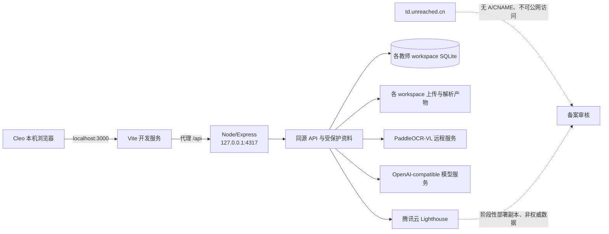

# DEMO 项目当前交接

> 本文是当前统一交接入口。历史专项文档只用于追溯当时的决策，不再代表当前 Git、数据路径或部署状态。
> 更新时间：2026-09-12；当前 Git 稳定基线：`origin/main@2af172f`（PR #21，AI 拆题输出契约修正）。

## 1. 当前阶段与产品边界

DEMO 已从本地原型进入“三名教师以内的私有网页试用”阶段。当前主要任务不是继续扩张架构，而是通过真实教师使用发现稳定性、交互和识别质量问题。

- 备案状态：`unreached.cn` 首次备案处于管局审核阶段；审核期间 `td.unreached.cn` 的 Cloudflare Tunnel DNS 记录已删除，公网入口主动下线，SSL 验证 TXT 保留
- 当前运行方式：MacBook 后台生产应用与 Tunnel LaunchAgent 均已停止；本地开发使用 `http://localhost:3000`，API 为 `127.0.0.1:4317`
- 下一阶段基础设施：腾讯云 Lighthouse 上海实例 `lhins-bjjni27g`，Ubuntu 26.04、4 vCPU、4 GB 内存、40 GB SSD、3 Mbps，公网 IP `115.159.196.231`
- 服务器阶段状态：Node/systemd、Nginx、已签发的 `td.unreached.cn` SSL 证书及一次产品数据恢复已完成内部验证；服务器副本不是当前权威数据，备案通过后必须从最新 `var-product` 重新制作最终快照
- 用户：管理员 Cleo 与最多两名受邀教师
- 身份边界：邀请注册、密码登录、管理员权限、每教师独立工作区
- 暂不承诺：校园网可达率、多人高并发、跨实例容灾和异地备份

## 2. Git 与协作基线

- GitHub `origin/main` 是唯一稳定基线；PR #21 在 PR #20 的材料解析控制和错误分类上，增加严格 JSON Schema、非空知识点示例和仅限次要字段的可恢复收敛。
- 母文件夹固定为 `/Users/cxc/Projects/DEMO`，正式服务只从这里运行，不从临时 worktree 运行。
- 每个代码任务先 `git fetch origin`，再从最新 `origin/main` 创建独立的 `codex/<功能名>` 分支和 worktree。
- 文档按用户约定可在母文件夹先同步 Git 后直接更新；代码仍不得在 `main` 上开发。
- 修改必须遵守根目录 `AGENTS.md`：先只读调查并提交具体方案，得到明确授权后写入；推送、PR、合并和部署分别需要授权。
- 真实环境变量只使用 `/Users/cxc/Projects/DEMO/.env`，不得提交、复制或输出其中的密钥。

## 3. 当前运行架构（备案审核期间）

- 前端：React 19、Vite 6、TypeScript、Tailwind CSS；桌面和手机共用一个响应式应用。
- 服务端：Express 5 同源托管生产前端、API 和受权限保护的资料内容。
- 数据：系统认证库与每教师工作区的 SQLite、上传文件、OCR 产物和任务状态全部位于持久目录。
- 后台生产应用与 Cloudflare Tunnel 已主动停止；本地开发的 API 与 Vite 在两个前台终端运行。
- 健康检查：`/api/health/live` 与 `/api/health/ready`；后者检查存储并报告 AI、PaddleOCR 配置状态。
- 长任务：OCR/AI 使用可查询状态；重启时进行中的任务标记为中断/失败，由用户重试，不阻塞已完成 PDF/OCR 查看。

## 4. 数据权威性与恢复边界

- 原始母数据 `/Users/cxc/Projects/DEMO/var` 保留为不可直接试错的历史母数据。
- 当前网页产品的运行权威数据为 `/Users/cxc/Projects/DEMO/var-product`。
- 自动备份位于 `var-product/backups/automatic`，仅在数据变化时创建，保留最近两份成功快照。
- 升级前独立恢复点位于 `/Users/cxc/Projects/DEMO/var/backups`，不参与自动清理。
- 当前备案下线前恢复点：`product-2026-09-12-pre-icp-offline`，包含 207 个文件和 5 个 SQLite，清单哈希与完整性校验均通过。
- 本地修复与测试继续写入唯一权威目录 `var-product`；最终迁移必须以切换时最新状态重新创建快照，不能使用服务器上的旧演练副本覆盖它。
- 恢复必须落到新目录，禁止覆盖故障目录。若故障版本已经产生用户新写入，先冻结并导出差异，再单独审批数据合并。

## 5. 已落地能力

- 班级、学生、座位图、班委、课表、日程和系统设置。
- 作业图片 OCR、AI 试批、证据复核、学情诊断和教师终审。
- PDF 资料上传、分页 PaddleOCR、原文/OCR 阅读、知识检索与知识结构建议。
- 邀请注册、管理员门禁、会话保护、跨用户工作区隔离和受保护资料下载。
- 作息完整时间输入；80 MiB 上传限制和中文错误；资料会话缓存与请求去重。
- PaddleOCR 原始块类型、Markdown、坐标和图片引用持久保存；表格、图片和公式安全渲染。

关键控制边界：OCR 与 AI 只产生可追溯草稿或建议；教师确认前不得静默改变正式知识结构或评分结果。局部解析失败应隔离，不阻塞已完成页面。

## 6. PR #17 部署状态

- PR：`https://github.com/CXC0515/demo/pull/17`
- 生产提交：`54ff5dc`
- 回填：2 个工作区、3 份资料、230 个候选块；安全更新 217 个内容块和 11 张页面底图。
- 保留异常：两个没有既有内容块的历史页面不自动补写，需要用户主动重新解析。
- 数据校验：两个 `resources.sqlite` 的 `integrity_check` 均为 `ok`；原始 PaddleOCR 标签没有被规范类型覆盖。
- PR #17 部署当时的服务验收：本机与公网 `ready` 为 200，存储、AI、PaddleOCR 均为 ready；公网与本地构建资源哈希一致；未登录资料 API 返回 401。该记录只代表当次验收，不代表当前公网持续可达。

详细实现与验证见 [RESOURCE_EDITOR_AND_SCHEDULE_UX_PLAN.md](./RESOURCE_EDITOR_AND_SCHEDULE_UX_PLAN.md)，运行和恢复操作见 [WEB_OPERATIONS_RUNBOOK.md](./WEB_OPERATIONS_RUNBOOK.md) 与 [WEB_DATA_MIGRATION_RUNBOOK.md](./WEB_DATA_MIGRATION_RUNBOOK.md)。

## 7. 当前风险与下一步

1. 首次备案审核期间不得恢复 `td.unreached.cn` 的公网解析或公开 IP/非标端口访问；Cloudflare Tunnel 对象和本地配置可保留，但连接器保持停止。
2. 本地修复期间 `var-product` 仍是唯一权威数据；启动其他 API 前必须确认没有第二个进程同时写入同一组 SQLite。
3. PaddleOCR 与模型服务可能排队或短暂返回 5xx；保留阶段状态、有限重试和人工重试入口。
4. 两个历史 OCR 页面缺少可一一对应的旧内容块，保持原状，重新解析后才进入新结构。
5. `npm ci` 仍报告 4 项既有依赖审计问题（1 low、2 moderate、1 high）；尚未评估破坏性升级，不能直接运行 `npm audit fix --force`。

当前先在 `http://localhost:3000` 修复和验收 Bug。备案通过后：更新服务器到最新 `origin/main`，冻结本地写入并从最新 `var-product` 创建最终在线快照，恢复到服务器新目录并校验，再把 `td` 解析到腾讯云公网 IP；完成 HTTPS、登录、资料、OCR、校园网和手机验收后，服务器数据才成为权威数据。MacBook 保留短期回滚副本。

## 8. 修改历史

| 版本 | 日期 | 状态 | 修改概要 |
| --- | --- | --- | --- |
| v1.0 | 2026-09-06 | 已归档 | 记录本地原型、母数据同步和网页部署前阻塞项。 |
| v2.0 | 2026-09-10 | 已归档 | 重写为真实生产交接：记录邀请登录、工作区隔离、`var-product`、Cloudflare Tunnel、LaunchAgent、PR #17 OCR 富内容迁移、恢复点和当前试用风险。 |
| v2.1 | 2026-09-10 | 已被 v2.2 取代 | 校正 Git 基线为 PR #18；记录公网 530 与 Tunnel 出口异常证据、已购服务器的未核实状态，以及下一会话的服务器迁移调查入口。 |
| v2.2 | 2026-09-12 | 已被 v2.3 取代 | 校正稳定 Git 基线为 PR #19；PR #17 仍是最近功能基线，服务器迁移边界不变。 |
| v2.3 | 2026-09-12 | 已被 v2.4 取代 | 校正稳定 Git 基线为 PR #20，记录 AI 批改材料解析控制和 COS 后续边界已合并部署。 |
| v2.4 | 2026-09-12 | 已被 v2.5 取代 | 记录 PR #21 对 AI 拆题输出契约、Prompt 非空示例和次要字段恢复边界的修正。 |
| v2.5 | 2026-09-12 | 当前 | 记录备案审核期间主动下线公网、MacBook 本地开发、腾讯云阶段性部署、最新恢复点及最终迁移必须重新同步 `var-product`。 |
