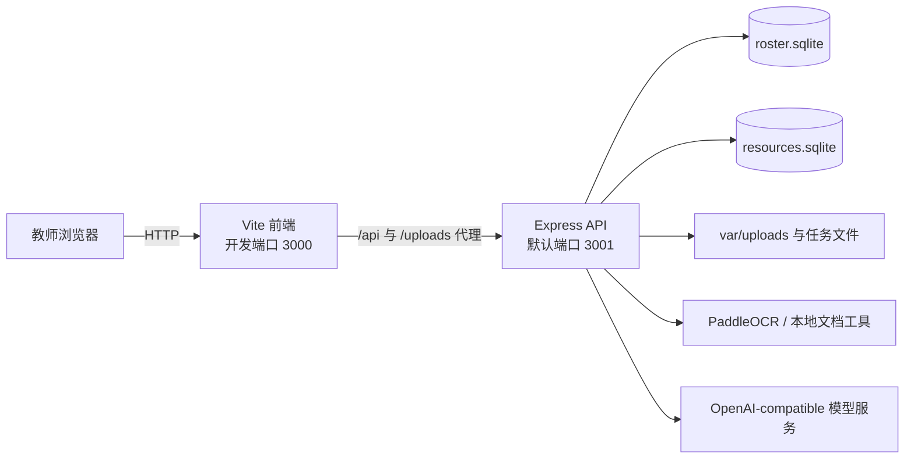

# DEMO 项目当前交接

> 本文是当前统一交接入口。历史专项文档只用于追溯当时的决策，不再代表当前 Git、数据路径或部署状态。

## 1. 目标与当前阶段

DEMO 正从本地教师工作台原型转向可持续使用的产品。当前主要矛盾已经从“功能是否存在”转为“真实数据能否安全持续保存、网页部署后能否稳定访问、教师能否看见并纠正 AI 的处理过程”。

当前产品仍是单教师、本地优先的 React + Express 应用，不是已经完成账号、权限、租户隔离和云存储的 SaaS。下一阶段应先完成一个可备份、可恢复、可观测的私有网页部署闭环，再决定是否进入多人 SaaS 架构。

## 2. Git 与协作基线

- GitHub 是代码唯一基线。
- 截至本文更新，最低基线为 `origin/main@fb09e151f435652e42c9501f631f884ced0b746f`，已包含 PR #6。
- 每个新任务先执行 `git fetch origin`，再从最新 `origin/main` 创建独立的 `codex/<功能名>` 分支和 worktree。
- 母文件夹 `/Users/cxc/Projects/DEMO` 当前可能检出其他分支，不得把它误认为 `main`。
- 项目修改必须遵守根目录 `AGENTS.md`：先调查和提交具体修改方案，得到明确授权后再写入。
- 真实环境变量只使用 `/Users/cxc/Projects/DEMO/.env`，不得提交、复制到文档或输出其值。

## 3. 已落地能力

- 教师工作台、班级与学生管理、座位、班委体系、课表、日程和系统设置。
- 学生画像与日常表现标签，以及班级/学生列表排序。
- 作业图片 OCR、AI 试批、证据复核和教师终审流程。
- PDF 资料上传、原生预览、分页 OCR、LaTeX 展示、解析耗时和任务状态。
- OCR 内容进入资源检索数据，并可产生待教师确认的知识节点和母子关系建议。
- 知识主干与资料编辑共用同一导航状态，桌面和移动视图已完成第一轮响应式适配。

关键控制边界：OCR 和 AI 生成的是可追溯的草稿或建议；教师确认前，不应静默改变正式知识结构或评分结果。局部解析失败应隔离，不应阻塞已完成页面的查看。

## 4. 当前运行结构



- 前端：React 19、Vite 6、TypeScript、Tailwind CSS。
- API：Express 4，由 `tsx` 直接运行 TypeScript。
- 数据：两个 SQLite 数据库、本地上传文件、解析产物和 JSON 任务状态。
- 外部依赖：OpenAI-compatible 模型接口、PaddleOCR API；部分文档流程还依赖本机 `paddleocr`/Python 和 PDF 工具。
- 健康检查：`GET /api/health`，目前只报告 API 存活和多模态模型是否配置。

当前 `vite.config.ts` 中 `/api`、`/uploads` 代理仅服务开发环境；`server/index.ts` 不托管 `dist`。因此现状不能仅执行 `npm run build` 后当作完整生产服务，也不适合直接部署到纯静态托管平台。

## 5. 权威本地数据

2026-09-06 已通过 SQLite 在线备份，把最新工作树数据同步到母文件夹：

- `/Users/cxc/Projects/DEMO/var/data/roster.sqlite`
- `/Users/cxc/Projects/DEMO/var/data/resources.sqlite`
- `/Users/cxc/Projects/DEMO/var/uploads/`
- `/Users/cxc/Projects/DEMO/var/data/grading-tasks.json`
- `/Users/cxc/Projects/DEMO/var/data/parser-artifacts/`

同步后的核验结果：

| 数据 | 数量 |
| --- | ---: |
| 班级 | 4 |
| 学生 | 53 |
| 课表项目 | 46 |
| 日程 | 24 |
| 班委角色 / 委派 | 3 / 4 |
| 上传资料 | 2 |
| 资料页 | 522 |
| 检索分块 | 220 |
| 知识节点 / 关系 | 62 / 16 |
| 待审发现 | 43 |

两库 `PRAGMA integrity_check` 均为 `ok`，资源库记录的两个 `disk_path` 已改为母文件夹绝对路径，关联原文件均存在。

同步前母文件夹数据库及被覆盖文件的恢复材料位于：

`/Users/cxc/Projects/DEMO/var/backups/pre-deployment-sync-20260906-195251/`

SQLite 使用 WAL 模式。后续迁移不得只复制主 `.sqlite` 文件；应使用 SQLite 在线备份并在迁移后检查完整性、关键表数量和资料文件存在性。

## 6. 本地启动

在从最新 `origin/main` 创建的工作树中安装依赖，并让进程读取母文件夹 `.env`。数据库和上传路径是相对当前工作目录解析的；如不复制数据，应显式设置绝对路径或建立经过确认的数据挂载方案。

开发模式：

```bash
npm install
node --env-file=/Users/cxc/Projects/DEMO/.env node_modules/tsx/dist/cli.mjs server/index.ts
npm run dev
```

默认访问地址是 `http://localhost:3000`，API 是 `http://localhost:3001`。

提交前按影响范围运行：

```bash
npm run lint
npm run test:roster
npm run test:classroom
npm run test:schedule
npm run test:resources
npm run build
```

涉及批改、视觉识别时，再运行对应的 `test:grading-*` 和 `test:vision-validation`。

## 7. 网页部署前的阻塞项

1. **生产入口缺失**：API 目前不托管构建后的前端，没有统一的生产启动脚本和优雅退出。
2. **持久化依赖单机文件系统**：SQLite、上传文件、解析产物必须位于持久卷，不能部署到会随实例重建而丢盘的纯无状态环境。
3. **身份边界缺失**：当前没有可靠的登录、会话、权限和租户隔离；公开暴露会泄露学生与教学资料。
4. **后台任务不耐重启**：OCR 任务在进程内执行，服务重启会把运行中任务标记为中断，尚无持久队列和自动恢复。
5. **资源与超时未定**：资料上传可达数百 MB，OCR/AI 可能持续数分钟；反向代理、平台请求体、请求超时和并发限制必须明确。
6. **运行依赖未封装**：本地 Python、PaddleOCR 和 PDF 工具是否进入镜像、是否改用远程服务，尚未作出部署决策。
7. **备份恢复未产品化**：已有本地快照，但没有定时备份、异地副本、恢复演练和数据保留策略。
8. **配置清单不完整**：代码支持 `RESOURCE_DB_PATH`，但 `.env.example` 尚未列出；生产环境变量和启动时校验需要统一。

## 8. 推荐部署路径

最短可验证路径是“单实例 Node 服务 + 持久磁盘 + 同源前后端 + 私有访问保护”：

- Express 同源托管 `dist`、`/api` 和受控的资料下载入口。
- SQLite、`var/uploads`、解析产物和备份目录统一挂载到持久卷。
- 在公开互联网之前至少加入可靠的单用户登录或平台访问门禁、HTTPS 和安全响应头。
- 增加启动配置校验、就绪/存活检查、结构化日志、优雅退出和备份脚本。
- 先迁移母文件夹真实数据的副本并完成一次恢复演练，再切换权威数据位置。

这条路径适合当前单教师验证，成本和迁移风险最低。只有在明确需要多教师并发、跨实例伸缩或协作编辑后，再进入 PostgreSQL + 对象存储 + 持久任务队列的第二阶段；不要为了“未来 SaaS”提前改写全部数据层。

## 9. 下一任务入口

执行部署任务前，将 [WEB_DEPLOYMENT_PROMPT.md](./WEB_DEPLOYMENT_PROMPT.md) 作为启动提示词。下一任务先完成只读部署审计与决策确认，不应在平台、域名、访问范围和预算未明确时直接写部署代码。
