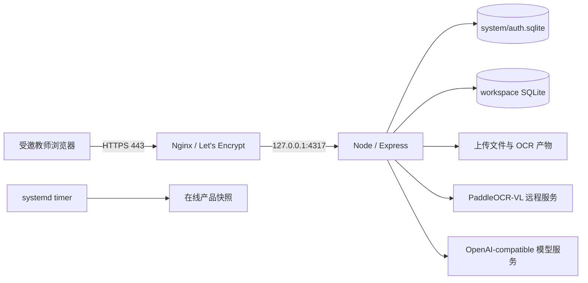

# DEMO 项目当前交接

> 本文是当前统一交接入口。历史专项文档只用于追溯当时的决策，不再代表当前 Git、数据路径或部署状态。
> 更新时间：2026-09-17；当前应用生产提交：`9837298`（PR #26）。

## 1. 当前阶段与产品边界

DEMO 已进入少量受邀教师使用的海外单实例生产阶段。

- 生产入口：`https://td.unreached.top`
- 生产实例：腾讯云 Lighthouse `lhins-mtpcwz75`，硅谷二区，Ubuntu 26.04，公网 IP `43.172.77.153`
- 运行规格：2 vCPU、2 GB 内存、50 GB SSD、30 Mbps 峰值带宽、2 GB swap
- 用户：管理员 Cleo 与最多两名受邀教师
- 身份边界：邀请注册、密码登录、管理员权限、每教师独立工作区
- 上海实例不运行 DEMO，后续单独用于 Hermes；本次没有修改该实例
- 暂不承诺：内地不同运营商可达率、多人高并发、跨实例容灾和异地备份

## 2. 当前生产架构

- DNS：阿里云 `td` A 记录指向 `43.172.77.153`，TTL 10 分钟。
- 公网只使用 80/443；80 自动跳转 HTTPS，应用端口 4317 只监听回环。
- 服务：`teacher-dashboard.service`；每日备份：`teacher-dashboard-backup.timer`。
- 代码：`/opt/teacher-dashboard/current` 指向 `/opt/teacher-dashboard/releases/9837298`。
- 数据：`/var/lib/teacher-dashboard/product-2026-09-16-r2`。
- 证书：Let's Encrypt，当前证书到期日 2026-12-15，Certbot 自动续期。
- 健康检查：`/api/health/live` 与 `/api/health/ready`。

## 3. 数据权威性与恢复边界

- 当前生产运行权威数据已切换为服务器目录 `/var/lib/teacher-dashboard/product-2026-09-16-r2`。
- 迁移源 `/Users/cxc/Projects/DEMO/var-product` 与手工恢复点 `/Users/cxc/Projects/DEMO/var/backups/product-2026-09-16-pre-overseas-cutover` 保留为切换前回滚证据，不再接受生产写入。
- 迁移快照包含 1,255 个产品文件和 5 个 SQLite，约 506 MiB；本地和服务器端的清单哈希、数据库完整性检查均通过。
- 服务器原始快照保留在 `/var/lib/teacher-dashboard/snapshots/product-2026-09-16-pre-overseas-cutover`。
- 首次恢复因 macOS `.DS_Store` 被误判为工作区而失败，失败目录 `/var/lib/teacher-dashboard/product-2026-09-16` 保留用于调查；修复经 PR #24 合并后恢复到全新 `-r2` 目录成功。
- 自动备份目录为 `/var/lib/teacher-dashboard/backups/automatic`；首次手工触发的服务器在线备份已成功。
- 若上线后产生新写入，不得用本地旧副本覆盖服务器数据；回滚前必须冻结写入、保留两边并制定差异处理方案。

## 4. Git 与协作基线

- GitHub `origin/main` 是唯一稳定基线，生产应用当前运行 `9837298`（PR #26）。
- PR #24 修复产品恢复工具：只遍历实际工作区目录，忽略 `.DS_Store` 等非目录元数据；聚焦测试 4/4 和 lint 通过。
- 母文件夹固定为 `/Users/cxc/Projects/DEMO`；正式发布只能来自已合并的 `origin/main`，不得长期依赖临时 worktree。
- 真实环境变量只存于服务器 `/etc/teacher-dashboard/teacher-dashboard.env`，权限 `600 root:root`；不得提交或输出密钥。
- 后续修改继续遵守根目录 `AGENTS.md` 的方案、授权、验证和 Git 边界。

## 5. 已完成验收

- 2026-09-17：PR #26 移动端管理优化已发布；服务器 npm ci、lint、build、座位测试 4/4 通过，回环及公网 live/ready 正常；公网静态资源哈希与新构建一致，5 个 SQLite 完整性和关键计数通过。保留旧发布目录 `03b3a0d`。本次仅更新代码，未修改生产数据目录或数据库结构。
- 手机班级详情改为底部面板，新增学生画像按钮、座位快捷换位，课表紧凑展示、四象限 2×2、标签四类同一行。完整验收及限制见 [MOBILE_MANAGEMENT_RELEASE.md](./MOBILE_MANAGEMENT_RELEASE.md)。

- 权威 DNS 与公共递归解析均返回 `43.172.77.153`。
- 云防火墙已允许 22、80、443；UFW 允许 OpenSSH 与 Nginx Full。
- Nginx 配置检查通过，公网 HTTP 自动跳转 HTTPS。
- 公网 `https://td.unreached.top/api/health/live` 返回 `{"ok":true}`。
- 服务器 `ready` 返回存储 ready，并确认 AI 与 PaddleOCR 已配置；这不等于真实调用成功。
- 未登录 `/api/classes` 返回 401。
- Playwright 真实打开 HTTPS 首页，看到“UNREACHED 教师工作台”“欢迎回来”和登录表单，无证书拦截页。
- 浏览器控制台中的 `/api/account` 401 是未登录状态的预期请求；Google Fonts 被现有 CSP 阻止是低优先级样式依赖问题，不影响登录页和服务可用性。

## 6. 已落地能力

- 班级、学生、座位图、班委、课表、日程和系统设置。
- 作业图片 OCR、AI 试批、证据复核、学情诊断和教师终审。
- PDF 资料上传、分页 PaddleOCR、原文/OCR 阅读、知识检索与知识结构建议。
- 邀请注册、管理员门禁、会话保护、跨用户工作区隔离和受保护资料下载。
- PaddleOCR 原始块类型、Markdown、坐标和图片引用持久保存；表格、图片和公式安全渲染。

关键控制边界：OCR 与 AI 只产生可追溯草稿或建议；教师确认前不得静默改变正式知识结构或评分结果。局部解析失败应隔离，不阻塞已完成页面。

## 7. 当前风险与下一步

1. 尚未主动消耗真实 AI/OCR 调用额度；首次真实使用时分别确认供应商调用、任务状态和人工重试链路。
2. 未使用真实账号继续进入核心数据页；登录页、鉴权边界、数据完整性和服务健康已完成最小上线验收。
3. 硅谷到中国内地的延迟和运营商可达性需由两名实际用户在各自网络中验证。
4. 自动备份与生产数据仍在同一实例，只能处理误操作和逻辑损坏，不能覆盖整机故障；规模扩大后再评估异地加密备份。
5. 2 GB 内存适合当前小规模试用，不代表可承载高并发 OCR/AI 任务。

运维、发布和证书操作见 [WEB_OPERATIONS_RUNBOOK.md](./WEB_OPERATIONS_RUNBOOK.md)；数据恢复见 [WEB_DATA_MIGRATION_RUNBOOK.md](./WEB_DATA_MIGRATION_RUNBOOK.md)；本次部署证据见 [OVERSEAS_PRODUCTION_DEPLOYMENT.md](./OVERSEAS_PRODUCTION_DEPLOYMENT.md)。

## 8. 修改历史

| 版本 | 日期 | 状态 | 修改概要 |
| --- | --- | --- | --- |
| v1.0-v2.5 | 2026-09-06 至 2026-09-12 | 已归档 | 本地原型、Cloudflare Tunnel、国内实例演练和备案期间下线状态。 |
| v3.0 | 2026-09-16 | 历史 | 记录硅谷生产切换、`td.unreached.top`、权威数据 `-r2`、HTTPS、自动备份及最小公网验收。 |
| v3.1 | 2026-09-17 | 当前 | PR #26 手机管理体验发布至硅谷实例，应用提交 9837298，数据目录保持 -r2。 |
