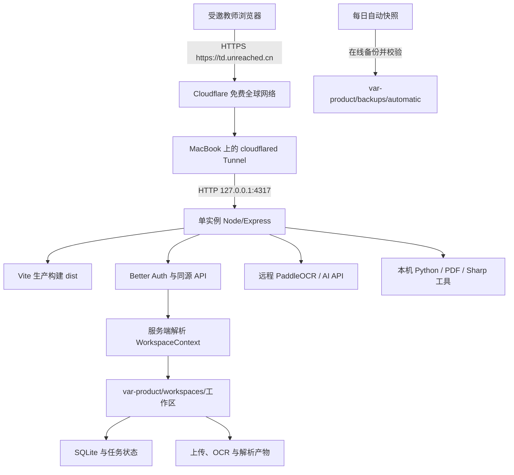

# DEMO 公网试用部署方案

> 文档版本：`v1.2`
> 日期：2026-09-08
> 状态：v1.1 已获批准；代码、数据恢复演练和本机生产烟雾测试已完成，待 GitHub 合并与公网接通
> Git 基线：`origin/main@db34ba370b4cba3fb7a9a6f4778e0818604afd77`

## 1. 原始问题和目标

当前 DEMO 已能在本机通过邀请注册、登录和独立工作区使用，但仍是开发进程，不能稳定邀请互联网用户。第一阶段的目标是让少量教师直接通过浏览器访问 `https://td.unreached.cn`，同时满足：

- 不购买服务器，MacBook 继续承担应用、计算和权威数据；
- 试用者无需安装软件，桌面和手机使用同一个响应式产品；
- 每位教师只读取自己的班级、学生、课表、资料、OCR、知识结构和批改记录；
- 部署、重启和升级不丢数据，出现问题可以切回已验证版本；
- 操作尽量由自动脚本完成，不要求用户学习日常运维命令。

## 2. 已确认事实、假设和未决问题

### 2.1 已确认事实

- 已购买根域名 `unreached.cn`；根域名留作未来主页或其他产品入口，教师工作台使用 `td.unreached.cn`。
- 但是确实根域名可以留着未来做更多更重要的事情。所以这个教室工作台可以是tcdb.unreached.cn，tcdb是teacher dashboard的缩写，怎么样，或者干脆td都行。

> [处理结果 2026-09-08] 已采纳。选择更短、较不易输错的 `td.unreached.cn`；`tcdb.unreached.cn` 不再作为默认入口。

- 第一阶段不购买服务器，也不依赖只有一个月的阿里云建站、共享 ECS、1GB 存储或 10GB CDN 权益。
- 外置盘完全不属于本方案：不读取、不写入、不配置、不作为恢复条件。
- MacBook 是 Apple Silicon，已有 Homebrew、Node `v24.11.1`、npm `11.6.2`；已安装 `cloudflared 2026.8.3`，尚未创建 Tunnel 或安装 DEMO 的 `launchd` 项。
- 生产代码已支持 Express 同源提供 Vite 构建产物、`/api` 和受保护资料；Node 默认可只监听 `127.0.0.1`。
- 认证使用 Better Auth；公共注册已关闭，邀请注册后不会自动登录，新用户得到空工作区。
- 候选产品数据位于 `/Users/cxc/Projects/DEMO/var-web-auth-candidate`，约 333MB；母文件夹 `/Users/cxc/Projects/DEMO/var` 约 1.6GB，其中已有四份约 326–339MB 的历史快照。
- 本机数据卷当前约剩余 38GB。现有历史快照不在本切片自动删除。
- 产品快照已覆盖认证库和所有工作区，对 SQLite 使用在线备份，并记录文件大小和 SHA-256。
- PaddleOCR 和 OpenAI-compatible 模型通过远程 API 调用；PDF 页面渲染、Sharp 图像处理及部分 Python/文档工具在 MacBook 本机执行。

### 2.2 待实测假设

- 家庭宽带上行、MacBook 在线时间和散热足以支持首批少量试用者。
- Cloudflare 免费全球网络在目标城市的中国电信、联通、移动链路上达到可接受速度。
- `launchd` 环境下能够找到 Node、Python、PDF 工具，并能访问 `.env` 中已配置的远程 AI/OCR 服务。
- 80MiB 的单次公网请求预算足以覆盖绝大多数试用资料；更大资料由所有者在 MacBook 本机受控导入。
- Agent Mail 人工发送的邀请和重置邮件能稳定投递到首批试用邮箱。

### 2.3 实施时需要交互确认的事项

- 用户需要在 Cloudflare 登录/注册页面完成账号身份验证。
- 用户需要在域名注册商控制台确认把 `unreached.cn` 的权威 DNS 切换到 Cloudflare 提供的名称服务器；执行前必须展示目标值和影响。
- 若公网三网实测不合格，是接受当前速度继续小范围测试，还是另行购买国内入口，必须由用户决定。

## 3. 是否需要修改代码

需要少量修改，但不重写产品架构：

1. 当前资料库允许 500MiB 单文件，批改材料允许 25MiB × 20，超过免费代理的实际请求预算；需要统一收紧并返回明确错误。
2. 当前产品快照需要人工指定目标，没有“无变化则跳过”和“只保留最近两份自动备份”的调度入口。
3. 当前只把资料解析中的运行任务标记为中断；要核对并补齐其他持久任务的重启状态，避免界面永久停在“处理中”。
4. 需要无密钥的生产启动、`launchd` 和 Tunnel 配置模板，避免依赖长期打开的终端。
5. 运行手册需要记录真实安装、切换、回滚和国内网络验收结果。

不需要改成微服务、PostgreSQL、对象存储或独立队列。

## 4. 推荐架构和数据流



关键边界：

- 浏览器只访问 `td.unreached.cn`，不直连 API 端口、上传目录或 AI 服务。
- Tunnel 只转发到本机回环地址，不开放家庭路由器端口，也不公开 MacBook IP。
- `workspaceId` 只由服务端会话产生；客户端参数不能决定文件路径。
- 原始资料和派生内容只通过已认证 API 返回，不建立公共 `/uploads`。
- AI/OCR 密钥只存在 `/Users/cxc/Projects/DEMO/.env`，不进入浏览器、仓库、日志或备份清单。

## 5. 域名、HTTPS 与中国大陆访问

### 5.1 默认入口

唯一正式入口为：

```text
https://td.unreached.cn
```

`unreached.cn` 的 DNS 托管到 Cloudflare，`td` 子域名记录指向命名 Tunnel；根域名暂不指向教师工作台。Cloudflare 在边缘终止 HTTPS，Tunnel 到 MacBook 的连接由 `cloudflared` 主动向外建立；MacBook 上的 Express 仍只监听 `127.0.0.1:4317`。

Cloudflare Tunnel 官方文档：<https://developers.cloudflare.com/cloudflare-one/networks/connectors/cloudflare-tunnel/>

### 5.2 不能作出的承诺

Cloudflare 免费全球网络不等于 Cloudflare 中国网络。中国网络是独立 Enterprise 能力，并有 ICP 等要求：<https://developers.cloudflare.com/china-network/>。

因此本阶段只能承诺真实测试，不能在测试前声称“国内稳定高速”。上线后连续 48 小时在真实中国电信、联通、移动及微信内置浏览器测试，覆盖晚高峰。若核心页面或文件访问持续不达标，暂停扩大邀请并重新审批国内入口；不会暗中增加服务器费用。

## 6. 身份验证和邮件

- 保持邀请制注册，不开放公开注册。
- 保持注册后返回登录页，再由用户明确登录。
- 所有业务 API、原始资料和派生文件继续要求有效会话及当前工作区授权。
- 会话使用生产 HTTPS Secure、HttpOnly、同源 Cookie；业务 API 不开放跨域 CORS。
- 修改请求继续校验 Origin、Fetch Metadata 和自定义同源头；登录、注册和上传继续限速。
- 所有者在设置页生成一次性邀请链接，通过已安装的 Agent Mail CLI 人工发送。
- 密码重置由所有者生成 30 分钟链接，再人工发送；本阶段不把 Agent Mail 交互式 CLI 嵌进 Node 服务，也不增加事务邮件供应商。

## 7. 上传和长任务

### 7.1 公网上传限制

按单次请求不超过约 80MiB 的目标设置：

| 类型 | 拟定限制 | 说明 |
| --- | ---: | --- |
| 资料库 PDF | 单文件 80MiB，1 个 | 给代理协议开销留出余量 |
| 批改材料 | 单文件 4MiB，最多 20 个 | 理论文件总量不超过 80MiB |
| 课表/日程导入 | 单文件 10MiB，1 个 | 足够常见 PDF 或图片 |

拒绝时返回中文提示。文件必须同时通过允许的扩展名、MIME 和基础内容检查；失败或超限产生的临时文件立即清理。超过限制的可信资料由所有者在 MacBook 本机通过受控导入流程预置，仍需登记到指定工作区，不能直接塞进目录绕过数据库。

### 7.2 OCR/AI 运行方式

- 远程：PaddleOCR API、OpenAI-compatible API。
- 本机：PDF 页面渲染、图像裁切、Sharp、Python 文档转换工具。
- 上传成功后长任务返回状态，浏览器通过现有查询接口查看进度；查看已上传 PDF 不等待 OCR 完成。
- 服务重启后，失去执行上下文的 `running/processing` 任务标记为 `interrupted/failed` 并允许人工重试，不伪造自动续跑。
- 不增加全局单并发锁。若本机实测出现内存压力，只对高 CPU/高内存的本机解析任务另行审批资源闸门。

## 8. MacBook 后台运行

仓库只保存不含密钥的脚本和模板；真实配置留在 MacBook：

- 应用 LaunchAgent：登录后启动生产 Node，异常退出自动重启；工作目录固定为 `/Users/cxc/Projects/DEMO`。
- Tunnel LaunchAgent：启动命名 Tunnel，断线后自动重连。
- 备份 LaunchAgent：每天检查一次；产品数据未变化则退出，不创建新快照。
- 生产环境：`NODE_ENV=production`、`APP_URL=https://td.unreached.cn`、`API_HOST=127.0.0.1`、`API_PORT=4317`、`APP_DATA_ROOT=/Users/cxc/Projects/DEMO/var-product`。
- `AUTH_SECRET` 生成不少于 32 字符的随机值，只写入现有 `.env`，终端和文档不打印值。
- 日志仅保留结构化运行信息并脱敏；不记录 Cookie、令牌、邮箱、学生姓名、文件名或 OCR 正文。

MacBook 合盖休眠、断电、系统更新重启和家庭宽带中断都会造成临时不可用，这是“不买服务器”的直接代价。

## 9. 数据迁移、备份和恢复

### 9.1 正式产品数据根

正式运行目录固定为：

```text
/Users/cxc/Projects/DEMO/var-product
```

它位于母文件夹中，不在任何 Codex worktree。代码 worktree 只用于开发，修改合并后从 `/Users/cxc/Projects/DEMO` 的 `main` 运行。

### 9.2 切换流程

1. 停止候选数据的写入并记录代码提交、源目录和时间。
2. 对 `/Users/cxc/Projects/DEMO/var-web-auth-candidate` 创建完整产品快照；所有 SQLite 使用在线备份。
3. 校验清单、SHA-256 和全部 SQLite `integrity_check`。
4. 只恢复到尚不存在的 `/Users/cxc/Projects/DEMO/var-product`，不覆盖任何目录。
5. 校验认证库、Cleo 所有者工作区、4 个班级、53 名学生、2 份资料、522 个资料页面及文件引用。
6. 使用 `var-product` 在回环地址启动，完成登录、跨账号隔离、资料、OCR、知识图谱和批改抽查。
7. 验收通过后才把 `var-product` 标记为产品权威数据根；原 `var` 和候选目录保持不动。

该切换属于数据写入，需在实施方案批准后执行。不会拿 `/Users/cxc/Projects/DEMO/var` 唯一母数据直接试错。

### 9.3 自动备份保留

- 仅备份 `var-product/system` 和 `var-product/workspaces`，不递归备份备份目录和日志。
- 每天最多检查一次；与上次成功快照相比没有变化时不创建备份。
- 变化时先创建新目录，完成 SQLite 在线备份、文件复制、哈希和独立校验；失败目录标记为 incomplete，不计入可恢复点。
- 新快照验证成功后，自动目录中只保留最近 2 份成功快照。
- 升级/迁移前快照放在独立目录，不被自动保留策略删除；确认稳定后再列出具体目标并单独申请删除。
- 当前 `var/backups` 内约 1.3GB 历史快照保持原样，本切片不删除。

本机同盘备份只能防误删、错误升级和数据库损坏，不能防整机丢失、磁盘物理损坏或勒索软件。用户已经明确接受第一阶段不使用外置盘，本方案也不擅自改用 iCloud 或其他云盘。

### 9.4 回滚与恢复演练

- 代码问题：停止新进程，切回已知稳定提交，仍使用兼容的数据根。
- 数据问题：停止写入，保留失败目录，从已验证快照恢复到一个全新目录；绝不覆盖当前目录。
- 公网入口问题：停止 Tunnel，应用仍可在 MacBook 本机回环地址检查。
- 切换后已有新用户写入时，不能直接回到旧副本继续使用；先冻结两边并另行制定差异处理方案。
- 公网开放前至少完成一次“备份 → 校验 → 新目录恢复 → 启动 → 浏览器抽查”的恢复演练。

## 10. 预计费用

| 项目 | 第一阶段费用 | 说明 |
| --- | ---: | --- |
| `unreached.cn` | 已购买 | 只关注续费和实名状态 |
| Cloudflare DNS/Tunnel/HTTPS | ¥0 起 | 免费全球线路，不含中国大陆网络保证 |
| MacBook | 已有设备 | 产生电费和设备损耗 |
| Agent Mail | 已授权 | 人工发送邀请和重置邮件 |
| AI/OCR | 现有按量费用 | 由实际调用量决定 |
| 服务器 | ¥0 | 本阶段不购买 |
| 外置盘/云备份 | ¥0 | 明确不纳入本阶段 |

## 11. 准备修改的文件和系统范围

### 11.1 代码和仓库文件

| 文件 | 拟修改范围 |
| --- | --- |
| `server/config/runtimeConfig.ts`、对应测试 | 集中定义生产上传限制和必要运行参数 |
| `server/routes/resources.ts` | 资料库 80MiB 限制、类型检查与失败清理 |
| `server/routes/gradingTasks.ts` | 批改材料 4MiB × 20 限制与失败清理 |
| `server/routes/schedule.ts` | 导入文件 10MiB 限制与失败清理 |
| `server/index.ts`、相关 repository/service | 启动时收敛遗留任务状态；不扩大为持久队列 |
| `server/services/operations/productSnapshot.ts`、对应测试 | 支持自动快照比较、完整校验和有限保留所需元数据 |
| `server/scripts/backupProductionData.ts` | 每日变更检测、创建、验证、保留最近两份 |
| `package.json` | 增加生产备份和运维校验命令 |
| `ops/launchd/*` | 增加无密钥应用、Tunnel、备份 LaunchAgent 模板 |
| `scripts/*` | 增加可重复安装/检查脚本，不把密钥写入仓库 |
| `docs/WEB_PUBLIC_TRIAL_DEPLOYMENT_PLAN.md` | 记录批准状态、实际变更、测试与历史 |
| `docs/WEB_PRODUCT_PHASE1_PLAN.md` | 同步第 3 切片结论 |
| `docs/WEB_OPERATIONS_RUNBOOK.md` | 写入后台运行、Tunnel、备份和故障操作 |
| `docs/WEB_DATA_MIGRATION_RUNBOOK.md` | 写入 `var-product` 切换与回滚记录 |

实施中若发现需要增加未列出的业务表迁移、自动邮件、全局任务队列或其他外部服务，立即停止并重新审批。

### 11.2 MacBook 与第三方状态

- 安装 Homebrew 包 `cloudflared`。
- 在用户目录创建 Cloudflare Tunnel 凭据和配置；凭据不进入仓库。
- 在 `/Users/cxc/Library/LaunchAgents` 安装三个 DEMO 专用 plist。
- 在现有 `/Users/cxc/Projects/DEMO/.env` 增加生产变量和随机 `AUTH_SECRET`，不展示既有密钥。
- 在 Cloudflare 添加 `unreached.cn`，在域名注册商处修改权威名称服务器，并把 `td.unreached.cn` 路由到 Tunnel；根域名不绑定工作台。
- 创建 `/Users/cxc/Projects/DEMO/var-product`、其自动备份及日志目录。

上述代码、数据副本和 MacBook 本地配置范围已由用户批准。GitHub 推送/PR/合并以及域名注册商名称服务器变更仍按本文件约定分别确认。

### 11.3 2026-09-08 实施记录

- 在独立 worktree `/Users/cxc/.codex/worktrees/web-public-trial-plan/DEMO`、分支 `codex/web-public-trial-plan` 上实施；生产服务不会长期从 worktree 运行。
- 上传限制已集中为资料 80 MiB、批改单文件 4 MiB × 20、课表 10 MiB；批改上传在业务字段无效时会清理已经落盘的临时文件。
- 启动时会把遗留的资料解析、材料处理和批改批次运行态收敛为失败/中断，保留人工重试入口，不伪造自动续跑。
- 自动备份已实现“在线备份 → 完整校验 → 内容比较 → 成功后原子发布 → 最近两份保留”；无变化实测会跳过且不留下临时目录，已损坏旧快照会保留供排查但不会阻止生成新的恢复点。
- 已加入生产环境原子配置脚本、应用/Tunnel/备份三个 LaunchAgent 模板和统一日志启动脚本。运行日志进入 macOS unified log，不写入 `var-product`，避免日志随产品快照重复膨胀。
- `cloudflared 2026.8.3` 已通过 Homebrew 安装；未创建 Tunnel、未启动服务、未修改任何 DNS。
- 候选数据已先在线备份到 `/Users/cxc/Projects/DEMO/var/backups/pre-public-trial-2026-09-08T055000+0800`，再恢复到全新的 `/Users/cxc/Projects/DEMO/var-product`。快照共 186 个文件、3 个 SQLite，清单哈希和数据库完整性均通过。
- 恢复后实测为 1 个用户、1 个工作区、4 个班级、53 名学生、46 条日程、2 份资料、522 个资料页面、62 个知识节点；2 个资料文件均存在，数据库内资料路径全部指向 `var-product`。
- 自动备份第一次创建成功，第二次在无数据变化时返回 `production_snapshot_skipped_unchanged`；当前自动目录只有 1 份成功快照。
- 使用 `var-product` 与正式 `dist` 在 `127.0.0.1:4317` 完成生产烟雾测试：首页与 SPA 深层路由 200、live/ready 200、未登录业务 API 和资料文件 401、SIGINT 优雅退出码 0。
- 完整检查通过：lint、生产构建和 99 项测试；`npm audit --omit=dev` 为 2 moderate、0 high、0 critical，均为既有 ExcelJS/uuid 链路。

尚未执行：真实 `.env` 生产值写入、LaunchAgent 安装、Cloudflare 账号授权和 Tunnel 创建、名称服务器/DNS 变更、公网与国内三网 48 小时验收。LaunchAgent 固定指向母文件夹，因此应在功能合并回 `/Users/cxc/Projects/DEMO` 后安装。

## 12. 实施顺序和授权边界

1. **代码与仓库模板**：再次 `git fetch origin`，从最新 `origin/main` 建独立 `codex/` 分支/worktree，完成代码、测试和本机候选演示。
2. **数据切换演练**：从候选产品数据创建在线快照，恢复到新 `var-product` 并校验；不改母数据。
3. **MacBook 后台运行**：安装 `cloudflared`、生产环境变量和 LaunchAgent，在回环地址验收。
4. **域名与公网**：登录 Cloudflare、展示 DNS/名称服务器目标，经确认后修改外部状态，接通 `https://td.unreached.cn`。
5. **验收与观察**：隔离、文件权限、重启、恢复、手机响应式和国内三网连续 48 小时验证。
6. **GitHub**：只有用户另行明确授权，才推送分支、创建 PR、合并和删除已合并的临时 worktree/分支。

任何一步失败都停止向后推进，保留可恢复状态并报告证据。

## 13. 风险、取舍和验收方法

| 风险 | 影响 | 当前控制与取舍 |
| --- | --- | --- |
| Cloudflare 大陆链路波动 | 页面或文件加载慢 | 三网 48 小时实测；不合格不扩大邀请 |
| MacBook/宽带中断 | 所有人暂时不可用 | `launchd` 自动恢复；无服务器就无法消除单机故障 |
| 同盘损坏或整机丢失 | 生产与备份同时丢失 | 已明确接受；同盘备份只负责误操作/升级回滚 |
| 上传挤占上行和磁盘 | 其他用户变慢 | 单请求约 80MiB 上限，大资料本机预置 |
| 服务重启中断 OCR/AI | 当前任务失败 | 持久状态改为 interrupted/failed，允许重试 |
| DNS 切换错误 | 域名暂时不可用 | 切换前记录旧值；Tunnel 先本机验收 |
| 邀请链接误发 | 未授权注册风险 | 邮箱绑定、一次性、过期、可撤销；管理员人工发送 |

公网开放门槛：

- `npm ci`、构建、TypeScript 和全部相关测试通过；
- 未登录 API/文件为 401，普通教师管理接口为 403，跨工作区资源不可读取；
- `https://td.unreached.cn` 证书有效，页面、API、文件均为同源，不公开本机端口；
- Node/Tunnel 在退出、断网恢复和 Mac 登录后能自动恢复；遗留长任务状态可解释、可重试；
- 产品快照校验、恢复到新目录和恢复后浏览器抽查通过；
- Cleo 管理员数据计数与文件引用正确，新邀请用户工作区为空；
- 桌面、平板、手机和微信内置浏览器完成登录、主要导航和文件查看；
- 电信、联通、移动连续 48 小时记录成功率、首屏时间、API 时间和 PDF 打开时间，再由用户决定是否扩大邀请。

## 14. 本阶段明确不做

- 不购买或部署服务器，不使用一个月建站权益保存学生真实数据。
- 不使用外置盘，也不擅自改用 iCloud/网盘。
- 不做微信小程序或第二套移动应用。
- 不开放公共注册，不做微信/GitHub 社交登录。
- 不接无人值守事务邮件，不把 Agent Mail OAuth 令牌交给 Web 服务。
- 不做 PostgreSQL、对象存储、Redis、微服务、跨实例队列或租户计费。
- 不保证 Cloudflare 免费线路具备中国大陆专线效果。
- 不自动删除现有历史备份、母数据、失败目录或升级前快照。
- 不提交 `.env`、认证密钥或 Tunnel 凭据。
- 未经单独授权不推送、不开 PR、不合并、不改 DNS。

## 15. 修改历史

| 版本 | 日期 | 状态 | 修改概要 |
| --- | --- | --- | --- |
| 对话草案 D0 | 2026-09-08 | 已被 v1.0 取代 | 曾使用 `app.unreached.cn` 并建议外置加密盘和较多历史保留；用户明确要求使用根域名并排除外置盘。 |
| v1.0 | 2026-09-08 | 已被 v1.1 取代 | 固定 `unreached.cn`、MacBook + Cloudflare Tunnel、无服务器、同盘最近两份自动备份、有限上传、人工 Agent Mail、`var-product` 正式数据根和国内三网实测边界。 |
| v1.1 | 2026-09-08 | 已批准并进入实施 | 采纳用户批注：根域名留作未来入口，教师工作台统一使用较短的 `td.unreached.cn`；同步架构图、`APP_URL`、Tunnel 路由和验收地址。 |
| v1.2 | 2026-09-08 | 当前，实施中 | 记录上传/任务/自动备份/后台模板实现、cloudflared 安装、`var-product` 在线快照恢复、99 项测试和生产烟雾结果；明确 GitHub 合并、真实环境配置与 DNS 仍未执行。 |
